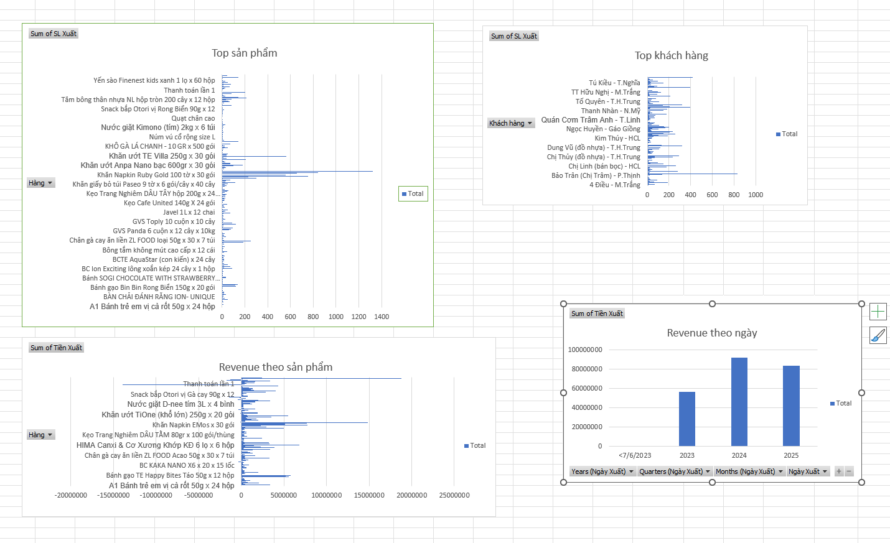

# 📊 Sales Dashboard Analysis (Excel)

## 🎯 Objective

This project aims to analyze sales performance using transactional data and build an interactive Excel dashboard to support business decision-making.

---

## 📁 Dataset

The dataset contains detailed sales transactions, including:

* Product (Hàng)
* Customer (Khách hàng)
* Quantity sold (SL Xuất)
* Revenue (Tiền Xuất)
* Profit (Doanh Thu)
* Date (Ngày Xuất)

---

## 🧹 Data Cleaning

Key preprocessing steps:

* Converted numeric fields from text to proper number format
* Standardized date format
* Created additional time-based features:

  * Year
  * Quarter
* Removed invalid and negative records (returns or input errors)

---

## 📊 Dashboard Features

The dashboard is built using **Excel Pivot Tables and Slicers**, including:

### 🔝 KPI Metrics

* Total Revenue
* Total Profit
* Total Quantity Sold

### 📈 Visualizations

* Top-selling products
* Revenue by product
* Top customers by quantity
* Revenue trends over time

### 🎛 Interactive Filters

* Year
* Quarter
* Product
* Customer

---

## 🔍 Key Insights

* A small number of products contribute the majority of total revenue
* Certain customers purchase frequently → potential key accounts
* Some transactions show negative values → likely returns or data issues
* Revenue is concentrated within specific time periods

---

## 🛠 Tools Used

* Microsoft Excel

  * Pivot Table
  * Pivot Chart
  * Slicer

---

## 📸 Dashboard Preview



---

## 🚀 How to Use

1. Open the Excel file in the `dashboard/` folder
2. Use slicers to filter data dynamically
3. Analyze performance by product, customer, and time

---

## 📁 Project Structure

```
sales-dashboard/
│
├── data/
│   └── raw.xlsx
│
├── dashboard/
│   └── dashboard.xlsx
│
├── images/
│   └── dashboard.png
│
├── README.md
```

---

## 💡 Future Improvements

* Add product categorization for deeper analysis
* Build Power BI version for enhanced visualization
* Apply customer segmentation techniques (RFM, clustering)

---
